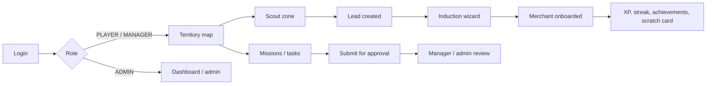
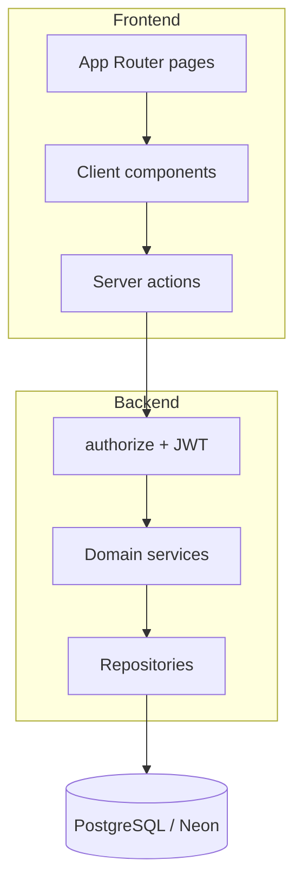

# Merchant Nation Command

**Gamified field operations platform for Cooperative Bank of Oromia**

Scout territories, onboard merchants, run missions, and track branch performance — from a single command center used by field staff, branch managers, and administrators.

[](https://nextjs.org/)
[](https://www.typescriptlang.org/)
[](https://www.prisma.io/)
[](https://tailwindcss.com/)

---

## Table of contents

- [Overview](#overview)
- [The problem we solve](#the-problem-we-solve)
- [What the platform does](#what-the-platform-does)
- [Roles and access](#roles-and-access)
- [Core workflows](#core-workflows)
- [Gamification](#gamification)
- [Notifications](#notifications)
- [Architecture](#architecture)
- [Tech stack](#tech-stack)
- [Data model](#data-model)
- [Repository structure](#repository-structure)
- [Getting started](#getting-started)
- [Environment variables](#environment-variables)
- [Scripts](#scripts)
- [Authentication and security](#authentication-and-security)
- [API documentation](#api-documentation)
- [Deployment](#deployment)
- [Demo guide](#demo-guide)
- [Team](#team)

---

## Overview

Merchant Nation Command is a full-stack web application built as an internship project for **Cooperative Bank of Oromia**. It turns merchant acquisition into a coordinated field operation:

- **Field officers** work a territory map, scout businesses, induct merchants, complete mission tasks, and submit daily reports.
- **Branch managers** assign work, approve tasks, review merchants, and monitor their branch.
- **Administrators** configure the bank network: branches, teams, users, ranks, scout categories, deployment assets, and bank-wide operational analytics.

The product is designed for mobile-first field use (touch layout, bottom navigation) and desktop admin use (sidebar layout). Performance is visible at every level — XP, ranks, streaks, leaderboards, and activity heatmaps — so onboarding feels like a mission rather than a form.

**Live production URL:** [https://coop-h2jv.vercel.app](https://coop-h2jv.vercel.app)

---

## The problem we solve

Merchant onboarding for a large branch network is slow when it lives in spreadsheets, paper, and disconnected tools:

1. Field staff lose track of which zones have been visited.
2. Lead-to-merchant conversion is hard to supervise.
3. Mission work is not assigned, approved, or audited in one place.
4. There is little daily motivation to keep scouting after the first few records.
5. Leadership cannot see branch health (territory, leads, merchants, activity) in real time.

Merchant Nation Command addresses this with **territory visibility**, a **scout → induct → merchant pipeline**, **mission tasking**, **role-based administration**, and **gamified engagement** (streaks, achievements, scratch cards, Telegram reminders).

---

## What the platform does

### Territory and map

- Branch territory rendered as a grid of cells over Addis Ababa (Leaflet / OpenStreetMap by default; Google Maps if an API key is set).
- Zone statuses: `UNSEEN`, `SCOUTED`, `CAPTURED`, `AT_RISK`, `FORTIFIED`, `LOST`.
- Map pins for leads and merchants; tapping a cell opens a drawer with scout and (for managers) status override.
- “My location”, map type (roadmap / satellite), and a status legend.

### Scouting and induction

- Scout a zone: business name, category (Cafe, Retail, Pharmacy, Fuel, Other), GPS, optional photo, estimated volume, competing banks.
- Convert a lead through a three-step **induction wizard**: Verify → KYC & Products → Oath (signature).
- Drafts can be saved and resumed later.
- Track which bank products / deployment assets were introduced and later onboarded.

### Missions and tasks

- Missions group goals and tasks for a branch or territory cell.
- Tasks are assigned to staff with statuses: `PENDING` → `IN_PROGRESS` → `SUBMITTED` → `APPROVED` / `REJECTED`.
- Staff can attach scout reports to a task.
- Branch managers and admins review pending approvals.

### Operations and admin

- Operational summary: missions, tasks, merchants, leads, territory health, assets, daily reports, and activity by branch.
- Activity log for auditable actions (login, mission create, merchant update, and similar).
- Admin catalogs: branches (synced from `branches.json`), teams, users, ranks, scout categories, external banks, deployment assets.
- Daily field reports.

### Profile and performance

- Rank and XP progress toward the next rank.
- Personal streak, freeze shields, contribution heatmap (365-day grid), daily challenges, scratch cards, and branch leaderboard.

---

## Roles and access

| Capability | Player (field staff) | Branch manager | Admin |
|---|---|---|---|
| Territory map for own branch | Yes | Yes | All branches |
| Scout leads / induct merchants | Yes | Yes | — |
| Missions and assigned tasks | Yes | Yes | Yes |
| Daily report | Yes | Yes | — |
| Own gamification (streak, heatmap, cards) | Yes | Own data | Own data |
| Approve tasks / manage branch users | — | Yes | Yes |
| Operational summary and reports | — | Branch-scoped | Bank-wide |
| Branches, ranks, categories, assets | — | — | Yes |
| Create users | — | Players in own branch | Any role |

Authorization is enforced on the server. Every mutation goes through `authorize(requiredRoles, actionName)` after the JWT session is verified. UI never talks to Prisma directly.

---

## Core workflows



**Scout → merchant (field path)**

1. Sign in as a player.
2. Open a zone on the map and submit a scout report.
3. Zone moves toward `SCOUTED`; a lead pin appears.
4. Start induction: verify details, capture KYC and products, sign the oath.
5. Merchant is created; gamification fires (streak, badges, optional scratch card).

**Mission path**

1. Admin or manager creates a mission with goals and assigned tasks.
2. Player works the task, optionally attaching scout reports.
3. Player submits; manager or admin approves or rejects.

---

## Gamification

Built so daily scouting feels like a game officers want to continue.

| System | What it does |
|---|---|
| **XP and ranks** | Actions award XP. Rank is derived from configurable `Rank` records (`minXp`, display order). Default starting rank is `CADET`. |
| **Streaks** | Consecutive active days. Freeze shields (earned periodically) protect a missed day. Milestones at 7, 14, 21, 30, 50, 100, 365 days. |
| **Achievements** | Auto-unlocked badges such as First Steps, Deal Maker, Lead Hunter, Merchant Master, streak legends, Speed Demon, Zone Conqueror, plus merchant-count badges. |
| **Scratch cards** | Awarded on merchant induction. Weighted rewards: XP, freeze shield, double-XP window, raffle ticket. 24-hour expiry. |
| **Daily challenges** | Three challenges per day (leads, merchants, zones, conversions) with XP on completion. |
| **Heatmap** | GitHub / LeetCode-style 365-day grid of leads or merchants. |
| **Leaderboard** | Ranked by XP within branch (or bank-wide context for admin dashboard). |

Gamification is triggered from domain actions (for example lead creation and merchant induction) via `triggerGamificationOnAction`. Users only see **their own** gamification data.

---

## Notifications

A channel router delivers events in-app and, when linked, over Telegram (email, WhatsApp, Facebook, and web push adapters exist behind env flags).

**Event types include**

- Scout submitted
- Achievement unlocked
- Daily streak reminder
- Inactivity / streak-at-risk (urgent)
- Weekly progress report

**Delivery rules**

- Per-user preferences: channels, quiet hours, max notifications per day
- Urgent alerts can bypass quiet hours
- In-app inbox at `/notifications`
- Telegram: user links the bot from Profile; messages include an action button that opens the **HTTPS** production app (Telegram requires HTTPS for inline buttons)

**Scheduling**

`POST /api/notifications/scheduled` with header `x-scheduler-secret` and body:

```json
{ "job": "daily-8am" }
```

Jobs: `daily-8am`, `daily-2pm`, `daily-5pm-urgent`, `weekly-sunday-7pm`.

Local development can use Telegram long-polling (`TELEGRAM_LOCAL_POLLING=true`). Production registers a webhook against the Vercel URL.

---

## Architecture

The app is a **single Next.js repository** with a strict logical split: the UI never owns business rules or database access.

```
Browser (RSC + Client Components)
        │  Server Actions  ("use server")
        ▼
src/app/actions/*          thin wrappers: cookies, redirects, exported types
        │
        ▼
src/backend/services/*     authorize(), validation, orchestration, activity logs
        │
        ▼
src/backend/repositories/* Prisma queries only
        │
        ▼
PostgreSQL (Neon)
```

**Conventions**

| Layer | Location | Responsibility |
|---|---|---|
| Pages / UI | `src/app`, `src/components` | Rendering and interaction |
| Server actions | `src/app/actions` | Thin `"use server"` wrappers |
| Services | `src/backend/services` | AuthZ, business logic |
| Repositories | `src/backend/repositories` | Prisma I/O |
| Shared auth | `src/lib/auth.ts` | JWT cookie session, `authorize()` |

Path aliases: `@/*` → `src/*`, `@backend/*` → `src/backend/*`, `@shared/*` → `src/shared/*`.

ESLint blocks `@/lib/prisma` inside `src/components` so the UI cannot import the database client.



---

## Tech stack

| Area | Choice |
|---|---|
| Framework | Next.js 16 (App Router), React 19 |
| Language | TypeScript (strict) |
| Database | PostgreSQL via Prisma 5; hosted on Neon |
| Auth | JWT (`jose`) in httpOnly cookie `mn_token`; bcryptjs passwords |
| UI | Tailwind CSS 4, Radix UI, shadcn-style components, Vaul drawers |
| Maps | Leaflet + React Leaflet; optional `@react-google-maps/api` |
| Forms | React Hook Form + Zod |
| Charts | Recharts |
| Notifications | Telegram Bot API; optional Resend, WhatsApp, Facebook, web push |
| Hosting | Vercel |

---

## Data model

Defined in [`prisma/schema.prisma`](prisma/schema.prisma). High-level entities:

```
Branch ─┬─ User (role, XP, rank, team)
        ├─ Team
        ├─ Zone / TerritoryCell  (polygon + ZoneStatus)
        ├─ Mission ─┬─ MissionGoal
        │           └─ MissionTask → Lead (task reports)
        └─ DailyReport

Lead (scouted) ── Merchant (inducted) ── MerchantDeploymentAsset
User ── Achievement, ScratchCard, DailyChallenge, UserStreak, Notification
FlashMission ── UserFlashMissionClaim
```

**Enums**

- `Role`: `PLAYER` | `BRANCH_MANAGER` | `ADMIN`
- `ZoneStatus`: `UNSEEN` | `SCOUTED` | `CAPTURED` | `AT_RISK` | `FORTIFIED` | `LOST`
- `MissionTaskStatus`: `PENDING` | `IN_PROGRESS` | `SUBMITTED` | `APPROVED` | `REJECTED`

Branches can be bulk-synced from [`branches.json`](branches.json) during seed.

---

## Repository structure

```
coop/
├── prisma/
│   ├── schema.prisma          # Data model
│   ├── migrations/            # SQL migrations
│   └── seed.js                # Demo users, branches, scout categories
├── public/
│   ├── openapi.yaml           # Logical API contract
│   └── images/                # Branding assets
├── src/
│   ├── app/                   # Routes, layouts, server actions, API routes
│   │   ├── actions/           # Thin server-action wrappers
│   │   ├── admin/             # Admin / manager consoles
│   │   ├── api/               # Webhooks, scheduled jobs, docs
│   │   ├── induct/            # Merchant induction
│   │   ├── missions/          # Missions and tasks
│   │   ├── scout/             # Scout forms
│   │   └── ...
│   ├── backend/
│   │   ├── services/          # Business logic + channel adapters
│   │   └── repositories/      # Prisma access
│   ├── components/            # Map, territory, gamification, UI kit
│   ├── contexts/              # Session / role context
│   └── lib/                   # Auth, Prisma client, ranks, nav
├── branches.json              # Branch catalog for seed
├── .env.example               # Documented environment template
└── package.json
```

---

## Getting started

### Prerequisites

- Node.js 20+
- npm
- A PostgreSQL database (local or [Neon](https://neon.tech))

### 1. Clone and install

```bash
git clone <repository-url>
cd coop
npm install
```

`postinstall` runs `prisma generate`.

### 2. Configure environment

Copy [`.env.example`](.env.example) to `.env.local` and fill in values (see [Environment variables](#environment-variables)). At minimum you need:

- `DATABASE_URL` and `DIRECT_URL`
- `JWT_SECRET` or `NEXTAUTH_SECRET`
- `NEXTAUTH_URL` / `NEXT_PUBLIC_APP_URL` (`http://localhost:3000` for local)

### 3. Database

```bash
npx prisma migrate deploy
npx prisma db seed
```

Seed creates scout categories, upserts branches from `branches.json`, and demo accounts (password `DevPassword1!`):

| Role | Email |
|---|---|
| Player | `player@example.com` |
| Branch manager | `manager@example.com` |
| Admin | `admin@example.com` |

### 4. Run

```bash
npm run dev
```

Open [http://localhost:3000](http://localhost:3000).

Interactive API docs: [http://localhost:3000/api-docs](http://localhost:3000/api-docs).

---

## Environment variables

Never commit `.env`, `.env.local`, or real secrets. Use `.env.example` as the template.

| Variable | Purpose |
|---|---|
| `DATABASE_URL` | Prisma connection (pooled URL in production) |
| `DIRECT_URL` | Direct Postgres URL for migrations |
| `JWT_SECRET` | Signs session JWTs (preferred) |
| `NEXTAUTH_SECRET` | Fallback secret if `JWT_SECRET` is unset |
| `NEXTAUTH_URL` | App origin for auth |
| `NEXT_PUBLIC_APP_URL` | Public app URL (notifications, links) |
| `NEXT_PUBLIC_GOOGLE_MAPS_API_KEY` | Optional; enables Google Maps instead of Leaflet |
| `NOTIFICATION_SCHEDULER_SECRET` | Protects `/api/notifications/scheduled` |
| `CRON_SECRET` | Cron / scheduler shared secret |
| `NEXT_PUBLIC_TELEGRAM_BOT_USERNAME` | Bot username for Profile deep-link |
| `TELEGRAM_BOT_TOKEN` | BotFather token |
| `TELEGRAM_WEBHOOK_SECRET_TOKEN` | Webhook verification |
| `TELEGRAM_LINK_BASE_URL` | HTTPS URL used in Telegram buttons |
| `TELEGRAM_WEBHOOK_BASE_URL` | Production origin for webhook registration |
| `TELEGRAM_LOCAL_POLLING` | `true` for local long-polling |
| `RESEND_API_KEY` / `RESEND_FROM_EMAIL` | Optional email channel |
| `FACEBOOK_*` / `WHATSAPP_*` | Optional messenger channels |
| `PUSH_GATEWAY_URL` / `PUSH_GATEWAY_TOKEN` | Optional web-push worker |

---

## Scripts

| Command | Description |
|---|---|
| `npm run dev` | Next.js development server |
| `npm run build` | Production build |
| `npm run start` | Serve the production build |
| `npm run lint` | ESLint |
| `npm run prisma:generate` | Generate Prisma Client |
| `npx prisma migrate deploy` | Apply migrations |
| `npx prisma db seed` | Seed demo data |
| `npx prisma studio` | Browse the database GUI |

---

## Authentication and security

- Email + password login; passwords hashed with bcrypt (10 rounds).
- Session is a JWT in an **httpOnly**, `SameSite=lax` cookie named `mn_token`.
- Cookie is `Secure` in production. Idle timeout is **5 minutes** (token `lastActivity` is checked on verify).
- First-login password change is supported (`mustChangePassword`).
- Role checks happen in backend services, not only in the UI.
- Activity log records sensitive mutations for admin reports.

---

## API documentation

The product uses **Next.js Server Actions** (same-origin, cookie session), not a public REST surface for the UI.

[`public/openapi.yaml`](public/openapi.yaml) documents the **logical** contract: auth, users, zones, missions, leads, merchants. Swagger UI is served at `/api-docs`.

Webhook / job HTTP routes that do exist:

| Method | Path | Purpose |
|---|---|---|
| `POST` | `/api/notifications/telegram/webhook` | Telegram updates |
| `POST` | `/api/notifications/facebook/webhook` | Facebook Messenger |
| `POST` | `/api/notifications/scheduled` | Cron jobs (secret header) |

---

## Deployment

Designed for **Vercel** + **Neon**.

1. Connect the GitHub repository to Vercel.
2. Set the same environment variables as production (including `JWT_SECRET`, `DATABASE_URL`, `DIRECT_URL`, Telegram webhook secrets, and `NEXTAUTH_URL` / `NEXT_PUBLIC_APP_URL` pointing at the HTTPS domain).
3. Deploy. Prisma Client is generated on `postinstall`.
4. Run migrations against Neon (`prisma migrate deploy`) from CI or a one-off command.
5. Register the Telegram webhook against `TELEGRAM_WEBHOOK_BASE_URL` (HTTPS is required for bot buttons).

Current production host: `https://coop-h2jv.vercel.app`.

---

## Demo guide

A short path that shows the system end-to-end in a presentation:

1. **Login as Player** (`player@example.com`) — territory map, bottom nav.
2. **Scout a zone** — submit a lead; mention XP / streak / notification.
3. **Open Profile** — rank, streak tracker, 365-day heatmap, leaderboard.
4. **Induct the lead** — Verify → KYC → Oath; show scratch card if awarded.
5. **Login as Manager** — pending task approvals, branch users, operational summary.
6. **Login as Admin** — all branches, ranks, categories, assets, bank-wide summary.
7. **Telegram (optional)** — Profile → link `notifycoop_bot`; show a reminder on the phone.

---

## Team

Internship project for **Cooperative Bank of Oromia**.

Built by a student engineering team. The codebase is a single Next.js application with a documented frontend / backend boundary so the work stays reviewable, testable, and extendable after handover.

---

## License

Private internship project. All rights reserved unless otherwise agreed with Cooperative Bank of Oromia.
